<div align="center">
<h1>MouthMap: Deep Learning Lip Reading System</h1>
  
  
  
  [](https://python.org)
  [](https://tensorflow.org)
  [](https://streamlit.io)
  [](LICENSE)
  [](https://github.com/d-kavinraja/MouthMap/stargazers)
  [](https://github.com/d-kavinraja/MouthMap/network)
  
  <h3>🚀 State-of-the-art lip reading technology powered by deep learning</h3>
  
  [🎯 Try Live Demo](https://mouthmap.streamlit.app/) • [📥 Download Model](https://www.kaggle.com/models/santhankarnala/40th-epoch-model-checkpoint/Keras/default/1) • [🐛 Issues](https://github.com/d-kavinraja/MouthMap/issues) • [💬 Discussions](https://github.com/d-kavinraja/MouthMap/discussions)
  
</div>

---

## 🌟 What is MouthMap?

**MouthMap** is an advanced deep learning project that interprets lip movements from video and transcribes them into text. Using a sophisticated architecture of **3D Convolutional Neural Networks (CNNs)** and **Bidirectional LSTMs** with a **CTC loss function**, MouthMap pushes the boundaries of silent speech recognition.

This research-focused project leverages computer vision and sequence modeling to assist in speech-impaired communication and human-computer interaction.

### ✨ Key Features

- 🎥 **Video-to-Text Transcription**: Converts lip movements in videos directly into coherent text sentences
- 🧠 **State-of-the-Art Architecture**: Built on a powerful 3D CNN + Bi-LSTM model to capture complex spatio-temporal features
- ⚙️ **End-to-End Pipeline**: Complete workflow from video preprocessing and data loading to model training and inference
- 🚀 **Real-time Potential**: Engineered for efficiency, laying the groundwork for live transcription applications
- 🧩 **Modular & Customizable**: Well-structured code making it easy to adapt, extend, and experiment with
- 🌐 **Live Web App**: Interactive Streamlit application for testing and demonstration

---

## 🎯 Applications & Use Cases

<table>
<tr>
<td width="33%" align="center">
  <h3>🦻 Accessibility</h3>
  <p>Empowering hearing-impaired individuals with advanced lip reading assistance</p>
</td>
<td width="33%" align="center">
  <h3>🤖 Human-Computer Interaction</h3>
  <p>Silent commands and natural interaction with smart devices</p>
</td>
<td width="33%" align="center">
  <h3>🔒 Security & Surveillance</h3>
  <p>Silent communication analysis in security applications</p>
</td>
</tr>
</table>

---

## 🎮 Live Demo & Pre-trained Model

### 🌐 Try the Web Application
**[🚀 Launch MouthMap App](https://mouthmap.streamlit.app/)**

Our interactive Streamlit app is now live! While accuracy with custom videos is continuously being improved, you can test its capabilities with the provided sample videos or upload your own.

### 📥 Download Pre-trained Model
**[Download 40th Epoch Model Checkpoint](https://www.kaggle.com/models/santhankarnala/40th-epoch-model-checkpoint/Keras/default/1)**

Access our pre-trained model weights from Kaggle Models - ready for inference and fine-tuning.

---

## 🏗️ Model Architecture

```mermaid
graph TB
    A[Video Input<br/>75 frames × 46×140] --> B[3D Conv Layer 1<br/>128 filters]
    B --> C[3D Conv Layer 2<br/>256 filters]
    C --> D[3D Conv Layer 3<br/>75 filters]
    D --> E[Reshape<br/>Flatten spatial dims]
    E --> F[Bidirectional LSTM 1<br/>128 units + 50% Dropout]
    F --> G[Bidirectional LSTM 2<br/>128 units + 50% Dropout]
    G --> H[Dense Layer<br/>41 units + Softmax]
    H --> I[CTC Decoding<br/>Text Output]
    
    style A fill:#e1f5fe
    style B fill:#f3e5f5
    style C fill:#f3e5f5
    style D fill:#f3e5f5
    style E fill:#e8f5e8
    style F fill:#fff3e0
    style G fill:#fff3e0
    style H fill:#fce4ec
    style I fill:#e1f5fe
```

<div align="center">
  


</div>

### 🔬 Architecture Details

| Layer Type | Configuration | Purpose |
|------------|---------------|---------|
| **Input Layer** | (75, 46, 140, 1) | 75 frames of 46×140 grayscale video |
| **3D Conv + MaxPool** | Filters: 128 → 256 → 75<br/>Kernels: (3,3,3) | Hierarchical feature extraction from spatio-temporal data |
| **Reshape Layer** | Flattens spatial dimensions | Prepares data for sequential processing |
| **Bidirectional LSTM** | 2 layers × 128 units<br/>50% Dropout | Captures temporal dependencies in speech patterns |
| **Dense Output** | 41 units + Softmax | Character probability distribution for CTC decoding |
| **CTC Loss** | Connectionist Temporal Classification | Alignment-free sequence-to-sequence learning |

---

## 📊 Dataset Information

### 📥 Download Dataset
```python
import gdown
import os

# Create data directory
if not os.path.exists('data'):
    os.makedirs('data')

# Download and extract dataset
url = 'https://drive.google.com/uc?id=1YlvpDLix3S-U8fd-gqRwPcWXAXm8JwjL'
output = 'data/data.zip'
gdown.download(url, output, quiet=False)
gdown.extractall(output, 'data/')
```

### 📁 Dataset Structure
```
data/
├── s1/                     # Video files (.mpg)
│   ├── bbal6n.mpg         # Sample: "bin blue at l six now"
│   ├── pgue7s.mpg
│   └── ...
├── alignments/             # Text alignment files
│   └── s1/
│       ├── bbal6n.align   # Corresponding text alignments
│       ├── pgue7s.align
│       └── ...
└── preprocessed/           # Processed data (created during training)
    ├── frames/
    └── labels/
```

---

## 🚀 Quick Start

### Prerequisites

- **Python 3.8+**
- **TensorFlow 2.x**
- **OpenCV** (cv2)
- **NumPy, Matplotlib**
- **FFmpeg** (for video processing)

### 📦 Installation

```bash
# 1. Clone the repository
git clone https://github.com/d-kavinraja/MouthMap.git
cd MouthMap

# 2. Create and activate virtual environment (recommended)
python -m venv venv
source venv/bin/activate  # On Windows: venv\Scripts\activate

# 3. Install dependencies
pip install -r requirements.txt

# 4. Download dataset (run the Python script above)
python download_dataset.py
```

### 🎯 Quick Inference Example

```python
import tensorflow as tf
import numpy as np
from your_project_utils import load_video, num_to_char, build_model, CTCLoss

# 1. Build and load the pre-trained model
model = build_model()
model.compile(
    optimizer=tf.keras.optimizers.Adam(learning_rate=0.0001), 
    loss=CTCLoss
)
model.load_weights('./models/checkpoint.weights.h5')

# 2. Load and preprocess video
video_path = './data/s1/bbal6n.mpg'
frames = load_video(video_path)
video_tensor = tf.expand_dims(frames, axis=0)  # Add batch dimension

# 3. Make prediction
yhat = model.predict(video_tensor)

# 4. Decode CTC output to text
decoded = tf.keras.backend.ctc_decode(yhat, input_length=[75], greedy=True)[0][0].numpy()
predicted_text = tf.strings.reduce_join(num_to_char(decoded)).numpy().decode('utf-8')

print(f"✅ Predicted Text: {predicted_text}")
# Example Output: "bin blue at l six now"
```

---

## 🔧 Advanced Usage

### 🎯 Training from Scratch

```python
# Configure training parameters
config = {
    'batch_size': 2,
    'epochs': 100,
    'learning_rate': 0.0001,
    'optimizer': 'adam'
}

# Prepare datasets
train_data = create_dataset('train')
val_data = create_dataset('validation')

# Define callbacks
callbacks = [
    tf.keras.callbacks.ModelCheckpoint('./models/checkpoint.weights.h5'),
    tf.keras.callbacks.LearningRateScheduler(scheduler),
    ProduceExample(val_data)
]

# Train the model
history = model.fit(
    train_data,
    epochs=config['epochs'],
    validation_data=val_data,
    callbacks=callbacks
)
```

### 🌐 Running the Streamlit App Locally

```bash
# Install Streamlit (if not already installed)
pip install streamlit

# Run the app
streamlit run app.py

# Access at http://localhost:8501
```

---

## 📈 Model Performance

### 🎯 Key Metrics
- **Architecture**: 3D CNN + Bidirectional LSTM
- **Training Epochs**: 100 (40th epoch checkpoint available)
- **CTC Loss**: Optimized for sequence alignment
- **Vocabulary Size**: 41 characters (a-z, 0-9, special characters)
- **Input Shape**: 75 frames × 46×140 pixels

### 🧪 Example Predictions
| Original Text | Model Prediction | Accuracy |
|---------------|------------------|----------|
| "bin blue at l six now" | "bin blue at l six now" | ✅ Perfect |
| "place green with t zero please" | "place green with t zero please" | ✅ Perfect |
| "set red by v four now" | "set red by v four now" | ✅ Perfect |

---

## 🛠️ Development & Customization

### 📋 Project Structure
```
MouthMap/
├── models/                 # Model architectures and weights
├── data/                   # Dataset and preprocessing
├── utils/                  # Utility functions
├── app.py                  # Streamlit web application
├── train.py               # Training script
├── inference.py           # Inference utilities
├── requirements.txt       # Dependencies
└── README.md             # This file
```

### 🔧 Key Functions
- `load_video()`: Video preprocessing and frame extraction
- `load_alignments()`: Text alignment processing
- `build_model()`: Model architecture definition
- `CTCLoss()`: Custom CTC loss implementation
- `char_to_num` / `num_to_char`: Character encoding/decoding

---

## 🤝 Contributing

We welcome contributions from the community! Here's how you can help:

### 🎨 Ways to Contribute
- 🐛 **Bug Reports**: Found an issue? [Create an issue](https://github.com/d-kavinraja/MouthMap/issues)
- 💡 **Feature Requests**: Have ideas for improvements?
- 🔧 **Code Contributions**: Submit PRs for bug fixes and features
- 📖 **Documentation**: Help improve our documentation
- 🧪 **Testing**: Test the system with different videos and datasets

### 🔄 Development Workflow
```bash
# 1. Fork the repository
# 2. Create a feature branch
git checkout -b feature/amazing-feature

# 3. Make your changes and test
python -m pytest tests/

# 4. Commit your changes
git commit -m "Add amazing feature"

# 5. Push and create a Pull Request
git push origin feature/amazing-feature
```

---

## 📈 Roadmap & Future Enhancements

<div align="center">


</div>

### 🎯 Upcoming Features
- [ ] **Attention Mechanisms** for improved sequence modeling
- [ ] **Data Augmentation** for better generalization
- [ ] **Real-time Video Processing** with WebRTC
- [ ] **Mobile Application** (iOS/Android)
- [ ] **Multi-language Support** (Spanish, French, German)
- [ ] **Cloud API** for scalable deployment
- [ ] **Edge Device Optimization** (Raspberry Pi, Jetson)

---

## 🙏 Acknowledgments

<div align="center">

**Built with ❤️ using cutting-edge technologies**

[](https://tensorflow.org)
[](https://python.org)
[](https://streamlit.io)
[](https://opencv.org)
[](https://kaggle.com)

Special thanks to the open-source community and researchers advancing lip reading technology.

</div>

---

## 📜 License & Citation

### 📋 License
This project is licensed under the MIT License - see the [LICENSE](LICENSE) file for details.

### 📚 Citation
If you use MouthMap in your research, please cite:

```bibtex
@software{mouthmap2024,
  title={MouthMap: Deep Learning Lip Reading System},
  author={Kavin Raja D},
  year={2024},
  url={https://github.com/d-kavinraja/MouthMap},
  note={Streamlit App: https://mouthmap.streamlit.app/}
}
```

---

## 🎯 Support & Community

<div align="center">

| Platform | Link | Purpose |
|----------|------|---------|
| 🌐 **Live Demo** | [mouthmap.streamlit.app](https://mouthmap.streamlit.app/) | Try the application |
| 🐛 **Issues** | [GitHub Issues](https://github.com/d-kavinraja/MouthMap/issues) | Bug reports & feature requests |
| 💬 **Discussions** | [GitHub Discussions](https://github.com/d-kavinraja/MouthMap/discussions) | Community Q&A |
| 📥 **Model** | [Kaggle Models](https://www.kaggle.com/models/santhankarnala/40th-epoch-model-checkpoint/Keras/default/1) | Pre-trained weights |

**Questions or feedback?** Feel free to reach out through GitHub issues or discussions!

</div>

---

<div align="center">
  
  **⭐ Star this repository if you find it helpful!**
  
  Made with ❤️ by Team MouthMap
  
  **🚀 [Try MouthMap Now](https://mouthmap.streamlit.app/) | 📥 [Download Model](https://www.kaggle.com/models/santhankarnala/40th-epoch-model-checkpoint/Keras/default/1)**
  
</div>
